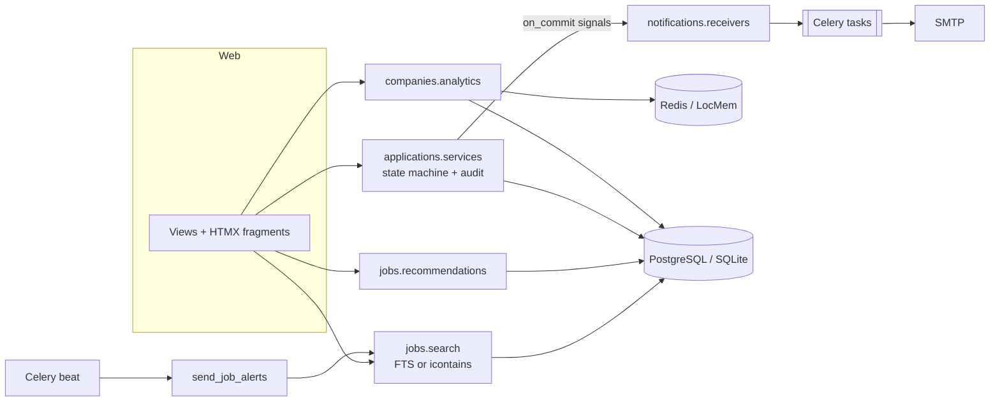

# HireWise

[](https://github.com/ebrahimmorkas/hirewise/actions/workflows/ci.yml)


**HireWise** is a full-stack **job board and applicant tracking system (ATS)** built with
Django and HTMX. Employers publish jobs and move candidates through a hiring pipeline on a
Kanban board. Candidates search with full-text ranking, get skill-based recommendations and
email alerts, apply in a few clicks and track every application.

It is a server-rendered app on purpose: HTMX gives it a single-page feel (live filters, in-place
pipeline moves, save toggles) without a separate frontend build, and every interaction still
works with JavaScript disabled.

---

## Features

### For candidates
- **Job search** with keyword, location, workplace, type, level, salary, skills and date filters; results update live and the URL stays shareable
- **PostgreSQL full-text search:** weighted title/company/description, stemming (`engineers` finds *Engineering*), `"phrases"` and `-exclusions`, relevance ranking. Falls back to substring search on SQLite
- **Recommendations:** jobs ranked by how many of your skills they need, with matching skills highlighted
- **Job alerts:** save any search as a daily or weekly email digest, with signed one-click unsubscribe
- Profile with **validated PDF resume upload**, completeness meter, saved jobs, and an application timeline

### For employers
- Company profile, job posting (draft → published → closed, automatic expiry)
- **Kanban pipeline:** applied → screening → interview → offer → hired, with enforced transitions
- Full **audit trail** per application, messages to candidates and **internal notes**
- **Hiring analytics:** views, conversion rate, a history-based funnel, a 30-day trend and top jobs (cached)
- Email on every new application and withdrawal

## Tech stack

| Layer | Technology |
| --- | --- |
| Backend | Django 6, django-filter, `django.contrib.postgres` search |
| Frontend | Django templates, HTMX 2, hand-written CSS (no build step) |
| Async | Celery 5 + beat *(Redis optional)* |
| Data | PostgreSQL *(SQLite fallback)*, Redis cache *(optional)* |
| Quality | pytest, pytest-django, factory_boy, Ruff, GitHub Actions |
| Ops | Docker (multi-stage, non-root), docker-compose, gunicorn, WhiteNoise |

## Architecture



```
apps/
├── accounts/       # email login, candidate / employer roles, role mixins
├── companies/      # company profiles, hiring analytics
├── jobs/           # Job, Skill, search, filters, recommendations, saved jobs
├── candidates/     # profile, resume validation
├── applications/   # Application + ApplicationEvent, workflow service, pipeline board
├── notifications/  # Celery email tasks, job alerts, signed unsubscribe
└── core/           # home, health check, seed_demo
```

## Redis is optional

| Variable | Set | Not set |
| --- | --- | --- |
| `DATABASE_URL` | PostgreSQL (ranked full-text search) | SQLite (substring search) |
| `REDIS_URL` | Redis cache + Celery broker | Local-memory cache, Celery tasks run eagerly |

Without Celery beat, job alerts can be sent with `python manage.py send_job_alerts` from cron.
CI runs the full test suite in **both** configurations.

## Getting started

```bash
python -m venv .venv && source .venv/bin/activate   # Windows: .venv\Scripts\activate
pip install -r requirements-dev.txt
cp .env.example .env
python manage.py migrate
python manage.py seed_demo
python manage.py runserver
```

| Demo account | Email | Password |
| --- | --- | --- |
| Employer (Northwind Analytics) | `employer1@hirewise.dev` | `demo-pass-123` |
| Candidate (with resume & applications) | `candidate@hirewise.dev` | `demo-pass-123` |

Or run the full stack with PostgreSQL, Redis, a worker and beat:

```bash
docker compose up --build
docker compose exec web python manage.py seed_demo
```

## Design decisions

**One code path for state changes.** Every status change goes through
`applications/services.py`. It locks the row, checks the transition table, writes an
`ApplicationEvent` and emits a domain signal on commit. Views, the HTMX board and the
admin can't bypass the rules or forget the audit entry.

**Search that degrades gracefully.** `jobs/search.py` checks the database vendor. On PostgreSQL
it uses a weighted `SearchVector`, `websearch` syntax and `SearchRank`. Matching uses the `@@`
operator and rank is used only for ordering, because `ts_rank` ignores negated terms. CI caught
exactly that bug on PostgreSQL. On SQLite every term must appear in some field.

**Alerts reuse the search filter.** A job alert stores the search querystring as JSON and is
matched with the same `JobFilter` as the search page, so "email me jobs like this" always
returns what the candidate saw. Digests claim the alert with a conditional `UPDATE` before
sending (no duplicates), and the unsubscribe link is a `django.core.signing` token.

**Private files stay private.** Resumes are validated by their `%PDF-` signature (the extension
and content type are client controlled), stored under random UUID names, and downloaded only
through an access-checked view. Applications keep a **snapshot** of the resume as submitted.

**Honest analytics.** The funnel counts applications that *ever reached* a stage (from the event
history), so a candidate rejected after an interview still counts as interviewed. All metrics
are aggregate queries, cached for five minutes.

## Testing

```bash
pytest                                     # SQLite, no Redis
pytest --cov                               # with coverage
DATABASE_URL=postgres://... pytest         # also runs the full-text ranking tests
ruff check . && ruff format --check .
```

## License

MIT
